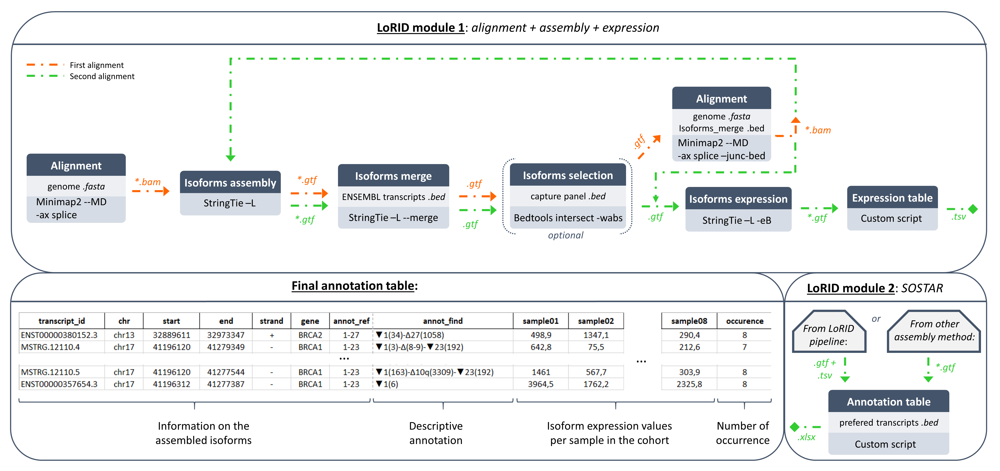
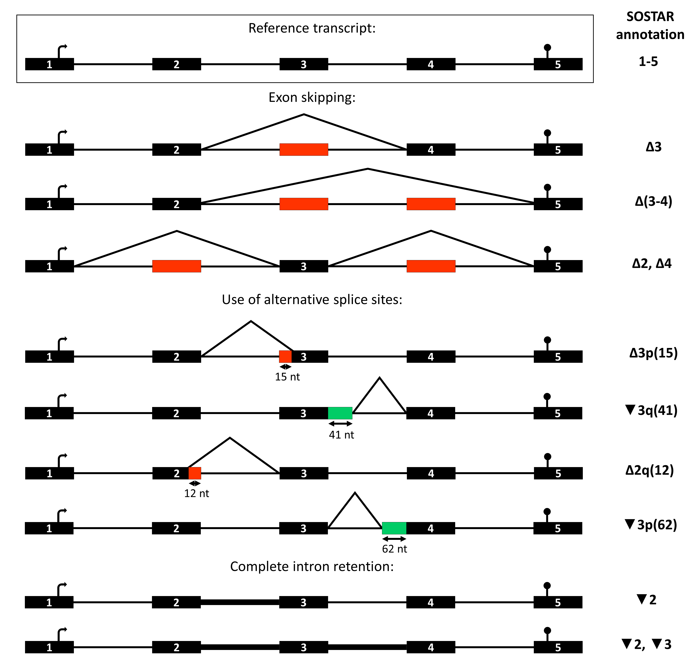

# **LoRID** - *Long Read Isoform Discovery*


**LoRID** is a versatile pipeline to assemble and describe isoforms from long read sequencing using a new annotation tool called **SOSTAR**: *iSofOrmS annoTAtoR*.
The pipeline is divided into two modules that can be run separately. 
- **First module**: The first module performs alignment (in two rounds) using [minimap2](https://lh3.github.io/minimap2/), assembled isoforms and computed isoform expression using [StringTie](http://ccb.jhu.edu/software/stringtie/index.shtml?t=manual).
- **Second module**: The second module provides a descriptive and comprehensive annotation of each assembled isoform. 
Isoforms are described relative to reference transcripts (provided by user) by an annotation including only alternative splicing events.



# Requirements

This pipeline is a **Snakemake workflow**. 

Dependencies:
- [Snakemake](https://snakemake-api.readthedocs.io/en/latest/) : 7.32.4 or greater.
- [Singularity](https://docs.sylabs.io/guides/latest/user-guide/) : 3.5.3 or greater.

*The workflow automatically uses a [docker image](https://hub.docker.com/r/aucam/lorid) which contains the other tools required.*


# Deploy workflow

> Download the Snakefile and rules of LoRID pipeline:
```
git clone https://github.com/LBGC-CFB/LoRID.git
cd ./LoRID
```

# Configure workflow

> To configure this workflow, modify the `./config/config.yaml` file according to your needs.

- `genome`: Fasta file of reference genome. Example in `./tests/hg19_chr17.fa`.

- `ensembl_annot`: GTF annotation file of known reference transcrits described in databases (Ensembl, Refseq, ...). Example in `./tests/gencode.v19.annotation_chr17.gtf`.

- `transcripts_list`: Txt file of the reference transcripts used for the annotation step. Name must match the "transcript_id" attribute from the `ensembl_annot` file. Example in `./tests/reference_transcripts_chr17.txt`.

- `indir`: Path of the directory containing the `.fastq.gz` input files.

- `outdir`: Path of the outdirectory.

- `samples`: names of the differents samples.

- `threads`: number of threads to use.

- `bedtools`: option to indicate whether or not bedtools will be used to filter out transcripts from the genes specified in the reference transcript file. "True" or "False".


# Run complete workflow

>  Given that the workflow has been properly configured, it can be executed as follows:
```
cd ./workflow
snakemake --use-singularity --cores
```  

## Output directory tree
```
LoRID/outdir
├── alignment
│   └── aligned
│       ├── {sample}.aligned.bam
|       ├── {sample}.aligned.bam.bai
│       └── ...
│   └── realigned
│       ├── {sample}.realigned.bam
|       ├── {sample}.realigned.bam.bai
│       └── ...
├── assembly
│   └── aligned
│       ├── {sample}.assembly.aligned.gtf
│       └── ...
│   └── realigned
│       ├── {sample}.assembly.realigned.gtf
│       └── ...
│   ├── transcripts.merged.aligned.filter.bed
│   ├── transcripts.merged.aligned.filter.gtf
│   └── transcripts.merged.realigned.filter.gtf
├── expression
│   ├── {sample}.expression.gtf
│   └── ...
├── ref_transcripts_annotation.bed
├── ref_transcripts_annotation.gtf
└── SOSTAR_annotation_table_results.xlsx
```

- `alignment` folder: contains subfolders of all aligned and sorted {sample} <.bam> with their corresponding index <.bai> either on the first (aligned subfolder) or the second (realigned subfolder) round of alignment.
- `assembly` folder: contains subfolders of all assembled <.gtf> {sample} with StringTie either on the first (aligned subfolder) or the second (realigned subfolder) round of alignment plus the global <.gtf> and it corresponding <.bed> file of the merge isoforms.
- `expression` folder: contains all assembled <.gtf> with expression metrics computed by StringTie.
- `ref_transcripts_annotation.bed`: <.bed> file containing the coordinates of the genes specified by the user in the reference transcript file. Used for the bedtools intersect option to filter transcripts for these genes.
- `ref_transcripts_annotation.gtf`: <.gtf> annotation file filtered out of reference transcrits specified by the user from ensembl annot.
- `SOSTAR_annotation_table_results.xlsx`: final output file containing descriptive annotation and expression metrics of each transcript in the cohort (see [SOSTAR annotation output file](##-SOSTAR-annotation-output-file) section for more informations).

# Run SOSTAR module only

The SOSTAR module can be used as a stand-alone tool, as it is a simple Python script.
Using <.gtf> files of assembled isoforms from any assembly method, it provides 
a descriptive and comprehensive annotation of each assembled isoform. 
This module is compatible with any gtf file using the tag attribute `gene_name` that match 
to the name of reference transcript feature provided by user.

```
python3 scripts/SOSTAR.py -I {INPUT} -O {OUTPUT} -R {REF_GTF_COORD}
```

Options:
- `-I`,    `--input`            :    /Path/to/gtf files

- `-O`,    `--output`           :    /Path/to/output directory

- `-R`,    `--ref_gtf_coord`    :    gtf annotation file filtered on reference transcripts used for the annotation


## SOSTAR annotation output file

SOSTAR generates a spreadsheet file in <.xlsx> format:

| transcript_id	| chr	| start	| end	| strand | gene | annot_ref | annot_find | barcode01 | barcode13 | barcode25 | barcode37 | occurence |
| ------------- | :-: | :---: | :-: | :----: | :--: | :-------: | ------------------------------------ | :-------: | :-------: | :-------: | :-------: | :-------: |
MSTRG.1.31 |	17 | 41196305 | 41277504 | - | *BRCA1* | 1-23 | ▼1(117),▼1q(534)-Δ(8-9)-Δ10q(3309)-▼23(7)| 10,51 | 2,66 | 37,43 | 7,34 | 4 
ENST00000491747.2 |	17 | 41197695 | 41277373 | - | *BRCA1* | 1-23 | Δ1(14),Δ1q(6)-Δ10q(3309)-Δ13p(3)-Δ23(1383)| 18,08 | 2,68 | 1,87 | 0 | 3 
 |	 |  |  |  |  |  |   |  |  |  |  

- *`transcript_id`* : transcript identifier
- *`chr`* : chromosome of transcript
- *`start`* : start position of the transcript
- *`end`* : end position of the transcript
- *`strand`* : strand of the transcript
- *`gene`* : gene associated to the transcript
- *`annot_ref`* : exon range of the reference transcript
- *`annot_find`* : SOSTAR annotation of transcript (see section [SOSTAR nomenclature](##-SOSTAR-nomenclature) for more details).
- *`sample`* : transcript coverage
- *`occurence`* : number of transcript occurrences in cohort

## SOSTAR nomenclature
Isoforms are described relative to reference transcripts (provided by user) by an annotation 
including **only the alternative splicing events**. SOSTAR uses the **systematic exon numbering**.
Some conventions were established to annotate the alternative splicing events:

| symbol	| definition	|
| :-:	| ---	|
| ∆	| skipping of a reference exon	|
| ▼	| inclusion of a reference intron	|
| p	| shift of an acceptor site	|
| q	| shift of a donnor site	|
| (37)	| number of skipped or retained nucleotides	|
| [p23, q59]	| relative positions of new splice sites	|
| exo	| exonization of an intronic sequence	|
| int	| intronization of an exonic sequence	|
| -	| continuous event	|
| ,	| discontinuous event	|

Nomenclature example:

*Black boxes: exon, black lines: intron, red boxes: exon (or part of exon) skipping, green boxes: novel exon (or part of exon).*

# Authors
Camille AUCOUTURIER @AUCAM

# License
This project is under GPL-3.0 License, see [LICENCE](https://github.com/LBGC-CFB/LoRID/blob/main/LICENSE) for more details.